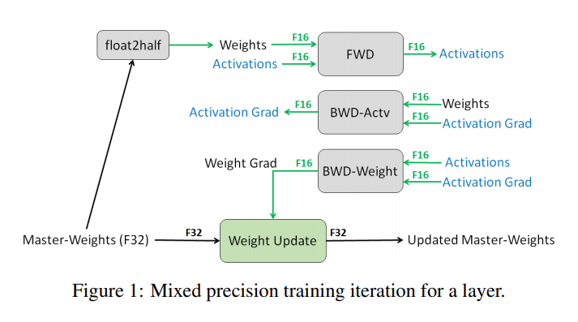

## amp-pytorch

> Pytorch自动混合精度训练模板

使用 pytorch 的自动混合精度教程。基于 [PyTorch 1.6 Official Features (Automatic Mixed Precision)](https://pytorch.org/docs/stable/notes/amp_examples.html) ，使用自定义数据集实现分类代码库


### 1 实验设置
1.1 环境设置
```
- Pytorch>=1.6.0 支持CUDA
- 本地实验环境为：RTX 3090 24G
```
1.2 下载数据集 Kaggle 英特尔图像分类
数据集地址：[Intel Image Classification](https://www.kaggle.com/puneet6060/intel-image-classification/)

该数据包含大约 25k 张大小为 150x150 的图像，分布在 6 个类别下。 {'建筑物' -> 0, '森林' -> 1, '冰川' -> 2, '山' -> 3, '海' -> 4, '街道' -> 5 }

数据集解压直接放在data目录下
```text
data:
    seg_pred
    seg_test
    seg_train
```


### 2 Baseline训练
实验设置:
- ImageNet Pretrained ResNet-18 from torchvision.models
- Batch Size 256 / Epochs 120 / Initial Learning Rate 0.0001
- Training Augmentation: Resize((256, 256)), RandomHorizontalFlip()
- Adam + Cosine Learning rate scheduling with warmup

运行命令
```text
python main.py --checkpoint_name baseline
```

### 3 混合精度训练

未使用混合精度训练：
```python
for batch_idx, (inputs, labels) in enumerate(data_loader):
  self.optimizer.zero_grad()

  outputs = self.model(inputs)
  loss = self.criterion(outputs, labels)

  loss.backward()
  self.optimizer.step()
```

使用混合精度训练
```python
scaler = torch.cuda.amp.GradScaler()

for batch_idx, (inputs, labels) in enumerate(data_loader):
  self.optimizer.zero_grad()

  with torch.cuda.amp.autocast():
    outputs = self.model(inputs)
    loss = self.criterion(outputs, labels)

  # Scales the loss, and calls backward() 
  # to create scaled gradients 
  self.scaler.scale(loss).backward()

  # Unscales gradients and calls 
  # or skips optimizer.step() 
  self.scaler.step(self.optimizer)

  # Updates the scale for next iteration 
  self.scaler.update()

```

运行命令
```shell
python main.py --checkpoint_name baseline_amp --amp;
```

### 4 实验性能

B : Baseline (FP32)
AMP : Automatic Mixed Precision Training (AMP)

|   Algorithm   | Test Accuracy | GPU Memory |  Total Training Time   |
|:-------------:|:-------------:|:----------:|:----------------------:|
|  B - 3090 Ti  |      94.17    |   13.0G    | (44s*20epochs)~=15mins |    
| AMP - 3090 Ti |      94.23    |   10.6G    | (33s*20eochs)~=11mins  |  

### 5 代码参考
- automatic-mixed-precision-tutorials-pytorch：https://github.com/hoya012/automatic-mixed-precision-tutorials-pytorch
> 代码主要来自该仓库，作者实现以及项目代码很完善了，主要将其拆分出来，可以灵活应用
- Baseline Code: https://github.com/hoya012/carrier-of-tricks-for-classification-pytorch
- Gradual Warmup Scheduler: https://github.com/ildoonet/pytorch-gradual-warmup-lr
- PyTorch Automatic Mixed Precision: https://pytorch.org/docs/stable/notes/amp_examples.html